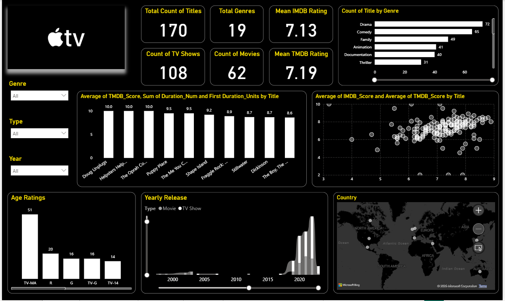
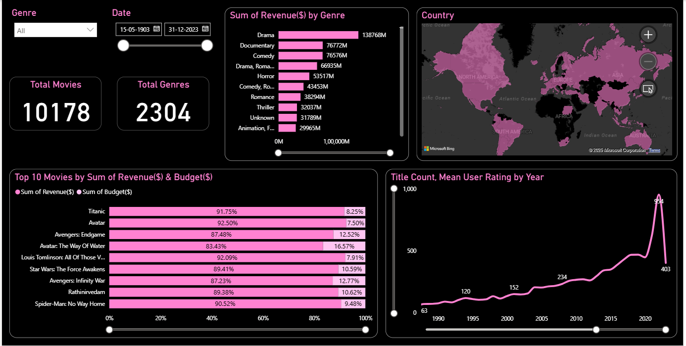

# IMDB-OTT-Platforms-Movies-And-Series-Dashboard

This project provides a Power BI dashboard analyzing movies and TV shows across multiple platforms (Netflix, Amazon Prime,  Apple TV, Disney+Hotstar, Bollywood, Hollywood). It highlights revenue, genres, user ratings, budgets, release trends, and more with interactive visuals.

---

## 📊 Dashboard Overview

The dashboard provides a comprehensive and interactive analysis of movie availability and performance across OTT platforms. It helps uncover:

* **Movie Distribution Across Platforms** — Overview of total movies, unique vs. overlapping titles, and availability trends across Netflix, Amazon Prime, Hotstar, Apple TV, and Bollywood OTT.
* **Genre Insights** — Analysis of top genres by platform, highlighting diversity in content such as Action, Comedy, Romance, Thriller, Suspense, and Kids.
* **Language & Regional Spread** — Breakdown of movies by language and region, offering insights into audience reach and platform-specific strengths.
* **Platform Comparison** — Comparative view of platforms in terms of content volume, variety, and exclusivity.
* **Movie Ratings & Popularity** — Insights into IMDb ratings, audience preferences, and platform-wise rating trends to identify where quality content resides.
* **Overlap & Exclusivity** — Visualizations of shared titles vs. exclusive content, helping identify competitive advantages across platforms.

---

## 🚀 Key Features

* **Interactive Visuals** — Clickable charts, slicers, and tooltips for seamless exploration across platforms, genres, ratings, and release years.
* **Key Performance Indicators (KPIs)** — At-a-glance metrics including total movies, average IMDb rating, platform-wise movie count, and genre popularity.
* **Segmented Analysis** — Dynamic filtering by OTT platform (Netflix, Amazon Prime, Disney+, Hotstar), genre, release year, and IMDb score range.
* **Actionable Insights** — Each page highlights platform strengths, top genres, rating distributions, and content availability to guide strategic OTT content decisions.

---

## 📈 Dashboard Pages

### 1. Netflix
* **What it shows:** High-level KPIs with total titles, genres, user ratings, release trends, and global distribution.
* **Key metrics:** Total titles (5,331), genres (42), average rating (64.66), movies (5,184), TV shows (147).
* **Visuals:** KPI cards, bar chart for age ratings, line chart of yearly releases (movies vs shows), world map of availability, bar chart of titles by genre, scatter plot of duration vs rating.
* **Insights:** Netflix has a large movie-focused library (97% movies, 3% shows). Age ratings are skewed toward mature audiences (TV-MA & TV-14 dominate). Releases grew sharply after 2010, peaking around 2018–2020. Genres are led by International movies (2.4K), Drama (2.3K), and Comedy (1.6K), showing its global-first content strategy. Global coverage is extensive, reflecting Netflix’s international penetration.


---

### 2. Amazon Prime
* **What it shows:** High-level KPIs with total titles, genres, content split (movies vs shows), age ratings, yearly release trends, and global distribution.
* **Key metrics:** Total titles (9,668), total genres (31), movies (7,814), TV shows (1,854).
* **Visuals:** KPI cards, bar chart for titles by genre, bar chart for age ratings, donut chart for type split (movies vs shows), yearly release trend (movies vs TV shows), world map of availability.
* **Insights:** Prime Video has a broader library than Netflix, with ~81% movies and ~19% TV shows. Genre mix is led by Drama (3.7K), Comedy (2.1K), and Action (1.7K). Audience coverage spans across multiple age ratings with stronger representation in family-friendly categories compared to Netflix. Content growth accelerated post-2010, with a sharp rise after 2015. Prime Video has wide global reach, strongly present across North America, Europe, and Asia.
  


---

### 3. Apple TV
* **What it shows:** High-level KPIs with total titles, genre mix, age rating distribution, release trends, average ratings, and country availability.
* **Key metrics:** Total titles (170), total genres (19), movies (62), TV shows (108), mean IMDb rating (7.13), mean TMDB rating (7.19).
* **Visuals:** KPI cards, bar charts for genres and age ratings, yearly release trend (movies vs. TV shows), scatter plot for IMDb vs. TMDB scores, top-rated titles, and global map.
* **Insights:** Apple TV+ has a compact but quality-focused catalog, with drama and comedy dominating. TV shows outnumber movies, reflecting an episodic-first strategy. Strong average ratings (~7.1–7.2) show positive reception. Content surged after 2019, with TV-MA leading age ratings. Global availability supports Apple’s premium positioning.



---

### 4. Disney+Hotstar
* **What it shows:** High-level KPIs with total titles, genre distribution, age rating mix, release trends, type split (movies vs TV shows), and duration by genre.
* **Key metrics:** Total titles (6,873), total genres (37), movies (4,567), TV shows (2,306).
* **Visuals:** KPI cards, bar charts for genre counts and age ratings, pie chart for type split, line chart for mean duration by genre, yearly release trends by type.
* **Insights:** Hotstar has a large and diverse catalog, with drama (2,043 titles) and comedy (791) dominating. Movies account for ~66% of content, but TV shows are also strong. Age ratings skew toward U/A 13+ and general audiences, showing wide family appeal. Release volume has surged significantly since 2015, highlighting expansion. Genres like sports and action feature the longest average durations.


---

### 5. Bollywood Insights
* **What it shows:** High-level KPIs with total movies, genre-wise revenue, budget vs revenue balance, yearly title output, and geographic focus.
* **Key metrics:** Total movies (1,321), total genres (243), top revenue genres (Comedy $351M, Drama $331M, Thriller $160M).
* **Visuals:** KPI cards, bar chart for revenue by genre, country map (India focus), stacked bars for top 10 movies (budget vs revenue), trend line for yearly title count and user ratings.
* **Insights:** Bollywood’s catalog shows strong revenue concentration in Comedy and Drama, with other genres like Thriller and Action also contributing significantly. Top-grossing films balance revenue and budget efficiently (e.g., Golmaal Again, Jia Aur Jia). Production peaked around 2015 with over 140 titles, before tapering slightly. India remains the core market, emphasizing Bollywood’s regional dominance with growing global recognition.


---

### 5. Hollywood Insights
* **What it shows:** High-level KPIs with total movies, revenue trends by genre, top-grossing films vs budgets, yearly production trends, and global reach.
* **Key metrics:** Total movies (10,178), total genres (2,304), top revenue genres (Drama $13,876M, Documentary $7,677M, Comedy $7,657M).
* **Visuals:** KPI cards, bar chart for revenue by genre, stacked bars for top 10 movies (budget vs revenue), line chart for yearly title count & ratings, world map for global distribution.
* **Insights:** Hollywood dominates with the largest catalog and highest-grossing titles globally. Blockbusters like Titanic, Avatar, and Avengers: Endgame deliver 85–93% of revenue-to-budget efficiency. Genre revenue is led by Drama, Comedy, and Documentaries, with consistent growth over decades. Title releases surged sharply post-2000, peaking around 2020 with nearly 1,000 films, underlining Hollywood’s scale and global impact.



---

## 📂 File Structure

```
.
├── IMDB-OTT-Platforms-Movies-And-Series.pbix                (Power BI report file)
├── Amazon-Prime-Titles.csv                    (Raw dataset)
├── Apple.csv                                  (Raw dataset)
├── Final-Bollywood.csv                        (Raw dataset)
├── Final-Hollywood.csv                        (Raw dataset)
├── Hotstar.csv                                (Raw dataset)
├── Netflix.csv                                (Raw dataset)
├── README.md                                  (Project documentation)
└── Previews/                                  (Dashboard screenshot images)
    ├── AmazonPrime.PNG
    ├── Apple.PNG
    ├── Bollywood.PNG
    ├── Hollywood.PNG 
    ├── Hotstar.PNG
    └── Netflix.PNG
```

---

## ⚙️ Technologies Used

* Microsoft Power BI Desktop

---

## 📊 Data Source

* **Dataset Name:** IMDB + OTT platforms movies Dashboard and Dataset
* **Source:** Kaggle
* **Link:** [https://www.kaggle.com/datasets/yashmotiani/imdb-ott-platforms-movies-power-bi-dashboard](https://www.kaggle.com/datasets/yashmotiani/imdb-ott-platforms-movies-power-bi-dashboard)

---

## 🚀 How to Use This Project

1. Clone or download the repository:

   ```bash
   git clone https://github.com/teesta57/IMDB-OTT-Platforms-Movies-And-Series.git
   ```
2. Open the `IMDB-OTT-Platforms-Movies-And-Series.pbix` file in Power BI Desktop.
3. Explore the dashboard and apply filters to interact with the data.

---

## 🤝 Contributing

You're welcome to fork the project, explore the dataset, enhance visualizations, or suggest improvements.

---


